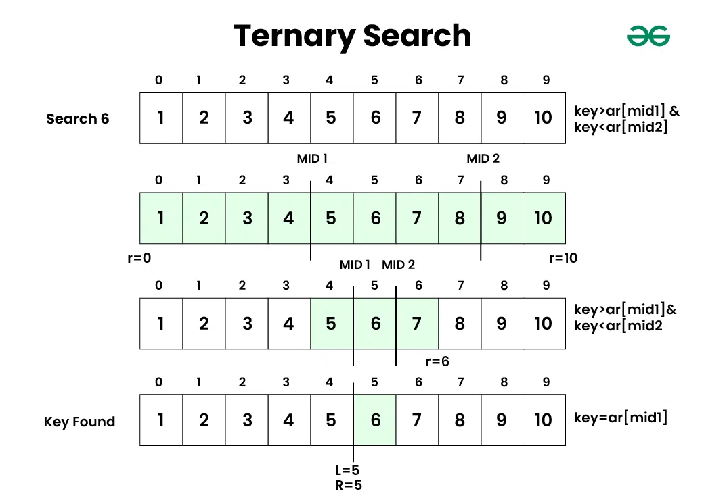
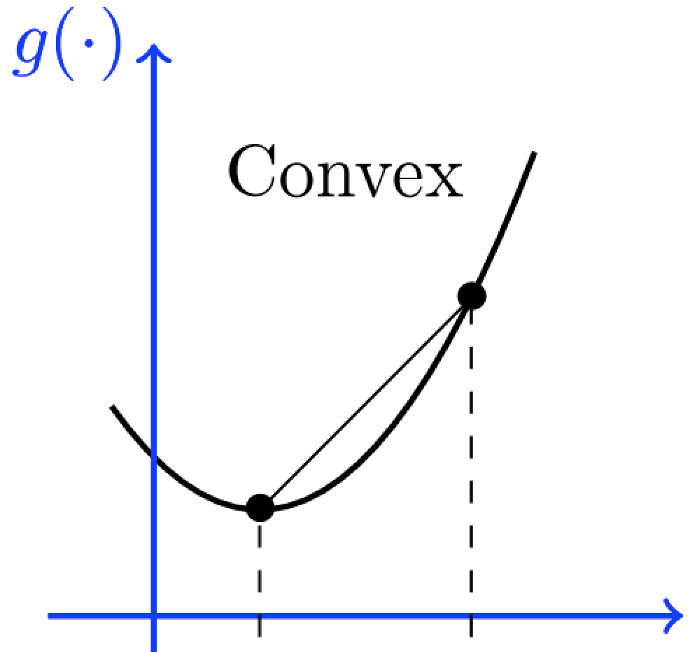
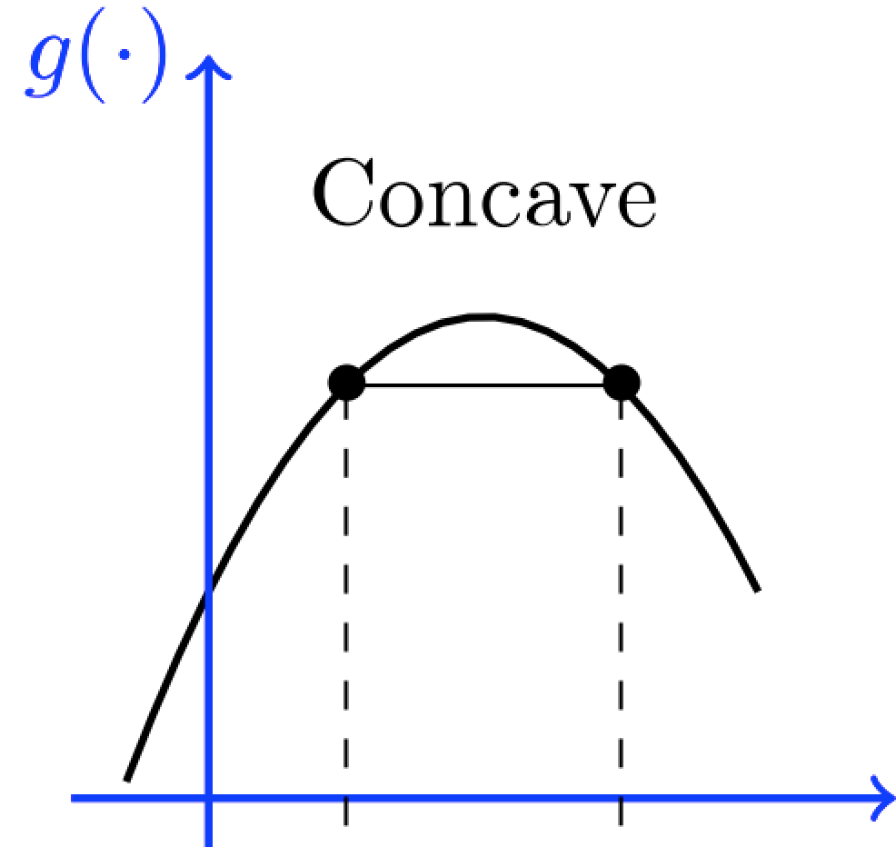
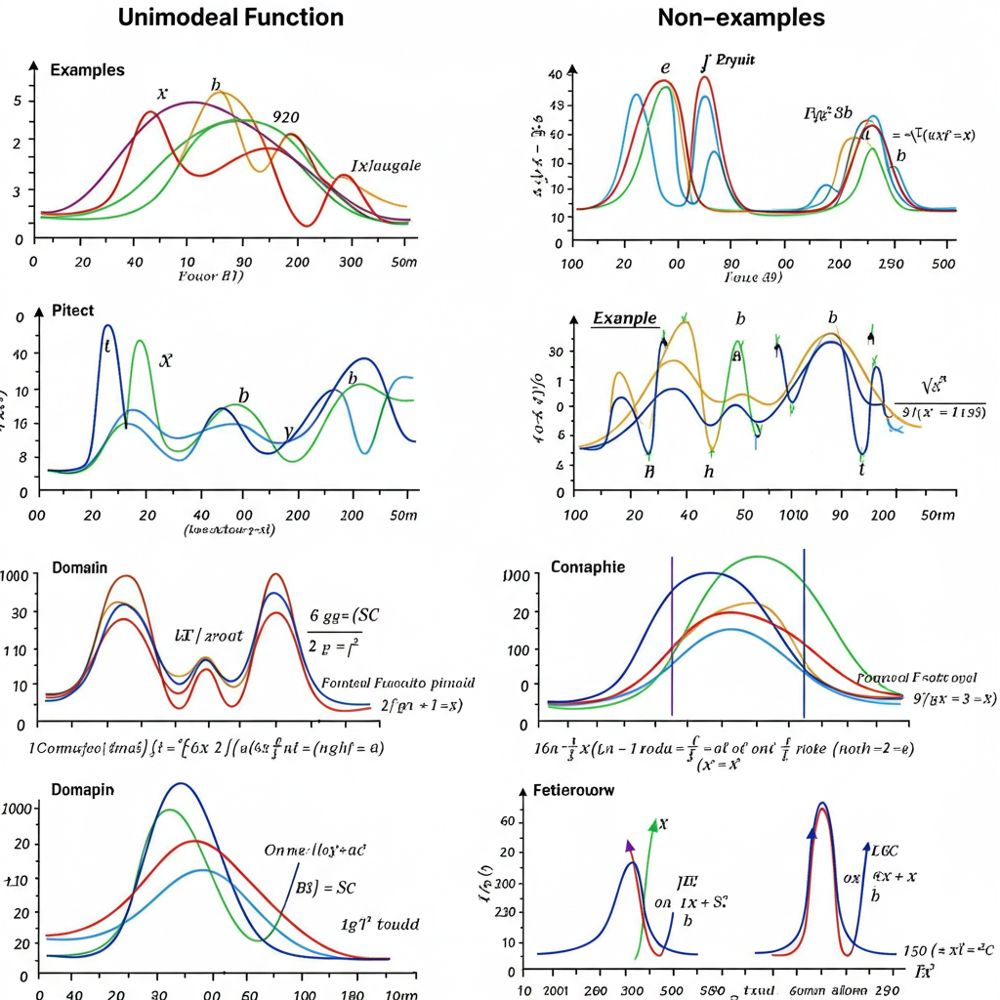

# ➗ Kỹ Thuật Tam Phân Tìm Kiếm (Ternary Search) 🚀

## 1. 👋 Giới thiệu về Tam phân tìm kiếm

Tam phân tìm kiếm (Ternary Search) là một thuật toán tìm kiếm **hiệu quả** 💪 được sử dụng để tìm **giá trị lớn nhất (hoặc nhỏ nhất)** của một hàm số **đơn đỉnh (unimodal)** trên một **khoảng xác định [L, R]** 🎯.  Khác với tìm kiếm nhị phân chia đôi không gian tìm kiếm, tam phân tìm kiếm **chia ba** ✂️ không gian tìm kiếm trong mỗi bước lặp, để nhanh chóng hội tụ về **điểm cực trị** 🌟 của hàm số.

### 💡 Ý tưởng cơ bản:

1. **📐 Chia khoảng:** Chia khoảng tìm kiếm hiện tại `[left, right]` thành **ba phần** bằng cách chọn **hai điểm chia** `m1` và `m2` nằm giữa khoảng:
    *   `m1 = left + (right - left) / 3`
    *   `m2 = right - (right - left) / 3`

2. **📈 Đánh giá hàm số:** Tính giá trị hàm số `f(x)` tại hai điểm chia `m1` và `m2`:
    *   `val_m1 = f(m1)`
    *   `val_m2 = f(m2)`

3. **🧐 Thu hẹp khoảng tìm kiếm:** So sánh `val_m1` và `val_m2` để quyết định thu hẹp khoảng tìm kiếm về phía nào chứa điểm cực trị:

    *   **Tìm giá trị lớn nhất (Max):**
        *   **⬆️ Nếu `val_m1 < val_m2`:** Giá trị lớn nhất có khả năng nằm ở **phía bên phải của `m1`**. Thu hẹp: `left = m1`.
        *   **⬇️ Nếu `val_m1 >= val_m2`:** Giá trị lớn nhất có khả năng nằm ở **phía bên trái của `m2` hoặc tại `m2`**. Thu hẹp: `right = m2`.

    *   **Tìm giá trị nhỏ nhất (Min):**  Thực hiện so sánh ngược lại:
        *   **⬇️ Nếu `val_m1 > val_m2`:** Giá trị nhỏ nhất có khả năng nằm ở **phía bên phải của `m1`**. Thu hẹp: `left = m1`.
        *   **⬆️ Nếu `val_m1 <= val_m2`:** Giá trị nhỏ nhất có khả năng nằm ở **phía bên trái của `m2` hoặc tại `m2`**. Thu hẹp: `right = m2`.

4. **🔄 Lặp lại:** Lặp lại các bước 1-3 một số lần đủ lớn (ví dụ, 100 lần) hoặc cho đến khi khoảng tìm kiếm `[left, right]` trở nên đủ nhỏ (ví dụ, `right - left < epsilon` với độ chính xác epsilon).

- 

### ✨ Ưu điểm chính:

*   **⏱️ Hiệu quả cho hàm đơn đỉnh:**  Tam phân tìm kiếm rất hiệu quả để tìm cực trị của hàm số đơn đỉnh.
*   **📉 Độ phức tạp logarit:** Tương tự như tìm kiếm nhị phân, tam phân tìm kiếm cũng có độ phức tạp thời gian **O(log N)**, với N là kích thước khoảng tìm kiếm ban đầu.

## 2. 🤔 Khi nào sử dụng Tam phân tìm kiếm? 📌

Tam phân tìm kiếm chỉ phù hợp khi hàm số mục tiêu có tính chất **đơn đỉnh (unimodal)**.  Đây là **điều kiện tiên quyết** để áp dụng kỹ thuật này:

### 2.1. ⛰️ Tính đơn đỉnh (Unimodal Function):

Một hàm số `f(x)` được gọi là đơn đỉnh trên khoảng `[L, R]` nếu nó có một trong hai dạng sau:

*   **⬆️ Lồi lên (Convex) - Tìm giá trị nhỏ nhất:** Hàm số **giảm dần** trên đoạn `[L, M]` và **tăng dần** trên đoạn `[M, R]`, với `M` là điểm cực tiểu duy nhất (hoặc một đoạn các điểm cực tiểu). 
*   **⬇️ Lõm xuống (Concave) - Tìm giá trị lớn nhất:** Hàm số **tăng dần** trên đoạn `[L, M]` và **giảm dần** trên đoạn `[M, R]`, với `M` là điểm cực đại duy nhất (hoặc một đoạn các điểm cực đại). 

**Minh họa tính đơn đỉnh:**

**Ví dụ về hàm đơn đỉnh:**

*   Hàm bậc hai có dạng lồi hoặc lõm (ví dụ: `f(x) = x^2`, `f(x) = -x^2 + 2x + 3`).
*   Tổng của các hàm lồi (hoặc lõm) (trong một số trường hợp).
*   Các hàm có tính chất "tăng rồi giảm" hoặc "giảm rồi tăng" một cách mượt mà.

**Ví dụ về hàm không đơn đỉnh:**

*   Hàm bậc ba trở lên (ví dụ: `f(x) = x^3 - 3x`).
*   Hàm có nhiều điểm cực trị cục bộ (không chỉ một cực trị toàn cục).
*   Các hàm số có đồ thị "gấp khúc", "dao động" nhiều lần.

### 2.2. ✅ Tính toán giá trị hàm số hiệu quả (Efficient Function Evaluation):

Tương tự như tìm kiếm nhị phân, hàm số `f(x)` cần phải tính toán được một cách **hiệu quả** ⚡ (thường là O(log N) hoặc tốt hơn). Độ phức tạp của việc tính hàm `f(x)` sẽ ảnh hưởng trực tiếp đến hiệu quả tổng thể của tam phân tìm kiếm.

## 3. 🚀 Các ứng dụng phổ biến của Tam phân tìm kiếm 🌟

Tam phân tìm kiếm thường được sử dụng trong các bài toán tối ưu hóa một biến số, khi hàm mục tiêu có tính chất đơn đỉnh. Dưới đây là một số ví dụ phổ biến:

* **3.1. 📐 Tìm cực trị của hàm số toán học:**

    Đây là ứng dụng **trực tiếp nhất** 🎯 của tam phân tìm kiếm. Tìm điểm cực đại hoặc cực tiểu của một hàm số toán học trên một khoảng cho trước.

    **💻 Ví dụ:** Tìm giá trị `x` trong khoảng `[0, 10]` sao cho hàm số `f(x) = -x^2 + 10x + 5` đạt giá trị lớn nhất. Trong trường hợp này, `f(x)` là hàm lõm xuống (hàm bậc hai với hệ số `a < 0`), nên có một cực đại duy nhất.

* **3.2. ⛰️ Bài toán tối ưu hóa đơn biến với hàm chi phí đơn đỉnh:**

    Trong nhiều bài toán thực tế, chúng ta cần tối ưu hóa một đại lượng nào đó (ví dụ, chi phí, lợi nhuận, thời gian) phụ thuộc vào một biến số duy nhất, và hàm chi phí (hoặc hàm lợi nhuận) có dạng đơn đỉnh.

    **📝 Ví dụ: Bài toán "Tìm điểm trên đồ thị có khoảng cách đến điểm P lớn nhất"**:

    Cho một đồ thị hàm số `y = f(x)` (ví dụ, parabol, đường cong) trên đoạn `[L, R]` và một điểm cố định `P(x_p, y_p)`.  Hãy tìm điểm `M(x, f(x))` trên đồ thị sao cho khoảng cách từ `M` đến `P` là **lớn nhất**.

    **Ứng dụng Tam phân tìm kiếm:**  Ta có thể định nghĩa hàm số khoảng cách `distance(x)` là khoảng cách từ điểm `(x, f(x))` trên đồ thị đến điểm `P`.  Trong nhiều trường hợp, hàm `distance(x)` (hoặc bình phương khoảng cách `distance(x)^2`) có tính chất đơn đỉnh trên đoạn `[L, R]`.  Khi đó, ta có thể dùng tam phân tìm kiếm để tìm giá trị `x` tối ưu hóa `distance(x)`.

    **💻 Ví dụ:** Cho parabol `y = x^2` trên đoạn `[-5, 5]` và điểm `P(2, 3)`. Tìm điểm `M(x, x^2)` trên parabol sao cho khoảng cách MP lớn nhất.

* **3.3. ⚖️ Tìm giá trị cân bằng trong một hệ thống đơn biến:**

    Trong một số bài toán vật lý hoặc mô phỏng, chúng ta cần tìm một "vị trí cân bằng" hoặc "trạng thái ổn định" của một hệ thống phụ thuộc vào một tham số duy nhất, và đại lượng đo lường sự "cân bằng" hoặc "ổn định" có tính chất đơn đỉnh.

    **💻 Ví dụ:** Tìm vị trí đặt trạm thu phát sóng tối ưu trên một đường thẳng để phủ sóng tốt nhất cho một khu vực dân cư, biết rằng cường độ sóng giảm dần theo khoảng cách, và dân cư tập trung thành một dải dọc theo đường thẳng. Ta có thể tìm kiếm nhị phân vị trí trạm phát để tối đa hóa "độ phủ sóng trung bình" (với một hàm đo độ phủ sóng phù hợp).

## 4. 🔑 Mẹo và Lưu ý khi triển khai Tam phân tìm kiếm 📝

Để triển khai tam phân tìm kiếm một cách chính xác và hiệu quả, hãy lưu ý những điểm sau:

* **4.1. 🔎 Xác định tính đơn đỉnh:**

    *   **Quan trọng nhất:** Trước khi áp dụng tam phân tìm kiếm, cần **chắc chắn rằng hàm số mục tiêu là đơn đỉnh** trên khoảng tìm kiếm. Nếu không, kết quả tìm kiếm có thể sai lệch hoặc không chính xác.
    *   **Phân tích toán học:** Cố gắng chứng minh hoặc có lý luận vững chắc về tính đơn đỉnh dựa trên đặc điểm của bài toán và hàm số.
    *   **Vẽ đồ thị (nếu có thể):** Vẽ đồ thị hàm số (hoặc thử vẽ phác họa) để kiểm tra trực quan tính đơn đỉnh.
    *   **Thử nghiệm và kiểm tra:**  Nếu không chắc chắn, có thể thử nghiệm với một vài giá trị khác nhau trong khoảng tìm kiếm và quan sát xu hướng biến đổi của hàm số.

* **4.2. 🎯 Chọn số lần lặp phù hợp:**

    *   **Số nguyên:** Với bài toán tìm giá trị nguyên, lặp khoảng **100 lần** thường đủ để đạt độ chính xác cao, vì sau mỗi lần lặp, khoảng tìm kiếm giảm đi khoảng 2/3.
    *   **Số thực:** Với bài toán số thực và yêu cầu độ chính xác `epsilon`, có thể lặp đến khi `right - left < epsilon`. Hoặc lặp một số lần cố định đủ lớn (ví dụ 100-200 lần).

* **4.3. 📐 Tính toán điểm chia `m1`, `m2` chính xác:**

    *   Sử dụng công thức đúng: `m1 = left + (right - left) / 3` và `m2 = right - (right - left) / 3` (hoặc các biến thể tương tự).
    *   Chú ý đến phép chia số nguyên và số thực tùy theo yêu cầu bài toán.

* **4.4. 📈⬇️ So sánh giá trị hàm số đúng cách (Tìm max vs. min):**

    *   **Tìm giá trị lớn nhất (Max):** `if (val_m1 < val_m2) left = m1; else right = m2;`
    *   **Tìm giá trị nhỏ nhất (Min):** `if (val_m1 > val_m2) left = m1; else right = m2;`
    *   **Không nhầm lẫn** điều kiện so sánh khi tìm max và min.

* **4.5. 🔢 Chú ý đến kiểu dữ liệu (Tránh tràn số, độ chính xác):**

    *   Sử dụng kiểu dữ liệu phù hợp (ví dụ: `long double` cho số thực, `long long` cho số nguyên lớn) để đảm bảo độ chính xác và tránh tràn số trong các phép tính.

## 5. 🎉 Kết luận

Tam phân tìm kiếm là một **kỹ thuật mạnh mẽ** 💪 và **hữu ích** ✨ cho việc tối ưu hóa các hàm số **đơn đỉnh**.  Mặc dù điều kiện áp dụng có phần hạn chế hơn so với tìm kiếm nhị phân (cần tính đơn điệu), nhưng khi bài toán thỏa mãn điều kiện đơn đỉnh, tam phân tìm kiếm là một công cụ **hiệu quả** để tìm ra cực trị một cách nhanh chóng.  Hãy **luyện tập** 🏋️‍♀️ với các bài tập khác nhau để làm quen và thành thạo kỹ thuật này! 😎

## 6. 🔗 Tham khảo và tài nguyên hữu ích 📚

*   [Ternary Search - GeeksforGeeks](https://www.geeksforgeeks.org/ternary-search/)
*   [Ternary Search - Wikipedia](https://en.wikipedia.org/wiki/Ternary_search)
*   [Topcoder Tutorial on Ternary Search](https://www.topcoder.com/thrive/articles/Binary%20Search%20and%20Ternary%20Search)

🚀 **Happy Coding!** 🎯